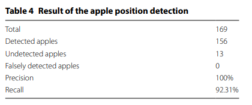
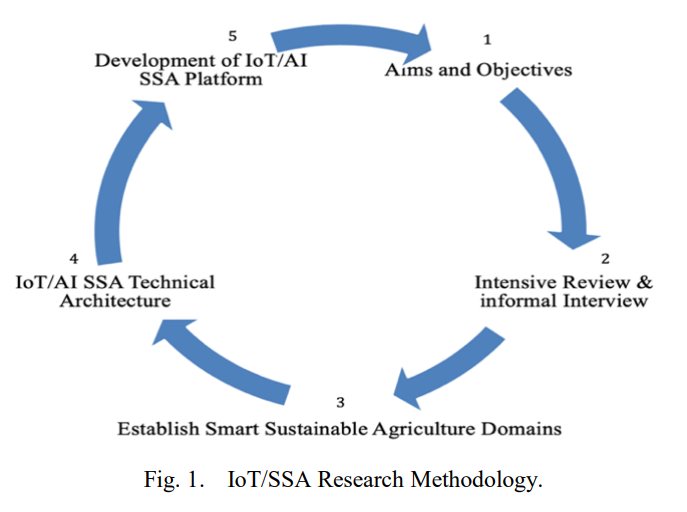

# Paper 1

Paper: An automated fruit harvesting robot by using deep learning.  

Published data: 2019  

contribution:  A highly fast and accurate method with a Single Shot MultiBox Detector is used to detect the position of fruit, and a stereo camera is used to detect the three-dimensional position then calculate angles of the joint. The robot arm is moved to the target fruit’s position. The robot then harvests the fruit by twisting the hand axis. The experimental results showed that more than 90% of the fruits were detected.  

Algorithm: 
**Process Flow**

**Harvesting Robot**

Dataset: Custom made dataset

Accuracy: 

Paper link: https://robomechjournal.springeropen.com/counter/pdf/10.1186/s40648-019-0141-2.pdf

# Paper 2
Paper: A Real-time Low-cost Artificial Intelligence System for Autonomous Spraying in Palm Plantations

Published data: 06 April 2021

contribution: Optimized YOLOv3 and named it Ag-YOLO which is competetive with YOLO-Tiny with very low power consumption and disk space to detect palm trees and spray accordingly.

Algorithm: They introduced a new version of YOLO-tiny backbone and named it shuffle net. Which is more accurate and faster then YOLO-tiny.

Dataset: Custom made dataset

Accuracy: 

**Result**

Paper link: https://arxiv.org/pdf/2103.04132.pdf

# Paper 3

Paper: Smart Sustainable Agriculture (SSA) Solution Underpinned by Internet of Things (IoT) and Artificial Intelligence (AI)

Published data: 05 May 2019

contribution: A servay paper brifing how can AI/ML and IoT help in Agriculture with least human involvement. Smart management system which will take inputs from different sensors, cameras and process these Inputs using AI/ML to get optimized output.

Irrigation: Getting input through sensors and irrigate right amount of water

Insecticide Spray: Uisng visual cues to get where to spray reduces great deal of insecticide usage.

Harvesting: AI/ML to detect which collect only the riped one.

Fertilizer: Using sensor data to predict which neutrition is needed and make a fertilizer to reach 
the need. Which will reduce the use of fertilizer.

Monitoring: Monitoring vast field is cumbersome and sometimes impossible. But AI powered drone can do it with much ease.

Algorithm:

Paper link: https://arxiv.org/abs/1906.03106

# Paper 4

Paper: Artificial Intelligence and Machine Learning Operated Pesticide Sprayer

Published data: 04 April 2022

contribution: Made a specialized moving object and get images through camera and using those data predict detect if it has any defect. and If it has, then spray insecticides.

Algorithm: Gaussian Naive Bias to classify if it is affected.

Dataset: Custom made dataset

Accuracy: 

Paper link: https://www.irjet.net/archives/V9/i4/IRJET-V9I4583.pdf

# Some Brainstorming Ideas
- Custom fertilizer for every chunk of plot
- Mechanical weed removal
- Making pods of vertical agriculture for indoor small farming
- Sattelite imaging for crop amount prediction
- Supershop, restaurants, resort, retail food waste reduction
